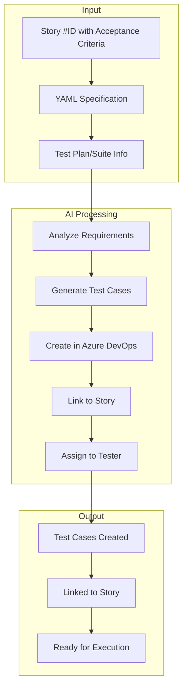

# Automated Test Case Creation & Linking

This guide provides a prompt template and workflow for automatically creating test cases from component stories and linking them to existing test plans in Azure DevOps.

---

## 📋 Overview

When a component story is created in Azure DevOps, test cases should be generated to ensure proper validation of the implementation. This automation:

1. **Analyzes** the story's acceptance criteria and YAML specification
2. **Creates** comprehensive test cases covering all requirements
3. **Links** test cases to the parent story via "Tests" relationship
4. **Assigns** test cases to the appropriate team member

---

## 🔧 Prerequisites

Before using this automation, ensure:

- ✅ **Azure DevOps MCP** is configured in Cursor (see [MCP Setup](./index#setting-up-azure-devops-mcp-in-cursor))
- ✅ **Test Plan exists** in Azure DevOps (you need the Test Plan name or ID)
- ✅ **Component Story exists** with acceptance criteria defined
- ✅ **Work Item permissions** include Test Case creation

---

## 🎯 The AI Prompt Template

Use this prompt in Cursor to automatically generate and link test cases:

````text
Analyze the Azure DevOps story #[STORY_ID] and create comprehensive test cases based on:
1. The acceptance criteria defined in the story
2. The YAML specification (variants, sizes, props, states, accessibility)
3. Standard component testing requirements

For each test case:
- Create a Test Case work item in Azure DevOps
- Use the naming convention: "[ComponentName] - [Test Objective]"
- Include: Objective, Pre-conditions, Test Steps, Expected Results
- Link the test case to story #[STORY_ID] using "Tests" relationship
- Assign to: [ASSIGNEE_EMAIL]

Test categories to cover:
1. **Functional**: All variants, sizes, and props render correctly
2. **Interaction**: Hover, focus, click behaviors work as specified
3. **Accessibility**: axe audit passes, ARIA attributes present, keyboard navigation works
4. **Edge Cases**: Empty states, long content, boundary conditions

After creating, provide a summary table of all test cases with IDs and titles.
````

---

## 📝 Prompt Parameters

| Parameter | Description | Example |
|-----------|-------------|---------|
| `[STORY_ID]` | Azure DevOps work item ID of the component story | `45` |
| `[ASSIGNEE_EMAIL]` | Email of person to assign test cases to | `developer@company.com` |

---

## 🚀 Complete Workflow

### Step 1: Identify the Story and Test Plan

First, get the story details and find your test plan:

```text
Get work item #45 and show me the acceptance criteria
```

```text
List all test plans in Azure DevOps
```

### Step 2: Generate Test Cases

Use the prompt with your specific values:

```text
Analyze the Azure DevOps story #45 and create comprehensive test cases based on:
1. The acceptance criteria defined in the story
2. The YAML specification (variants, sizes, props, states, accessibility)
3. Standard component testing requirements

For each test case:
- Create a Test Case work item in Azure DevOps
- Use the naming convention: "Tooltip - [Test Objective]"
- Include: Objective, Pre-conditions, Test Steps, Expected Results
- Link the test case to story #45 using "Tests" relationship
- Assign to: inam.hasan@altudo.co

Test categories to cover:
1. **Functional**: All variants, sizes, and props render correctly
2. **Interaction**: Hover, focus, click behaviors work as specified
3. **Accessibility**: axe audit passes, ARIA attributes present, keyboard navigation works
4. **Edge Cases**: Empty states, long content, boundary conditions

After creating, provide a summary table of all test cases with IDs and titles.
```

### Step 3: Verify Results

After the AI creates the test cases, verify:

```text
List all test cases linked to story #45
```

---

## 📊 What Gets Created

For a typical component like "Tooltip", the AI will create test cases such as:

| ID | Test Case Title | Category |
|----|-----------------|----------|
| #46 | Tooltip - Verify all placement positions render correctly | Functional |
| #47 | Tooltip - Verify hover trigger with delay | Interaction |
| #48 | Tooltip - Verify accessibility (axe) compliance | Accessibility |
| #49 | Tooltip - Verify keyboard navigation (Tab and Escape) | Accessibility |
| #50 | Tooltip - Verify all variants render correctly (default, info, warning) | Functional |
| #51 | Tooltip - Verify size variations (sm, md) | Functional |

Each test case includes:

```html
<h3>Test Case: [Title]</h3>
<p><strong>Related Story:</strong> #[STORY_ID] - [Component Name]</p>

<h4>Objective</h4>
<p>[What this test validates]</p>

<h4>Pre-conditions</h4>
<ul>
<li>Application is running</li>
<li>Component is implemented</li>
</ul>

<h4>Test Steps</h4>
<ol>
<li>[Step 1]</li>
<li>[Step 2]</li>
<li>[Step 3]</li>
</ol>

<h4>Expected Results</h4>
<ul>
<li>[Expected outcome 1]</li>
<li>[Expected outcome 2]</li>
</ul>
```

---

## 📝 Test Case Structure Best Practices

Azure DevOps Test Cases have two important fields for test execution:

1. **Description** - Summary information (Objective, Pre-conditions, overview)
2. **Steps** - Structured test steps with Actions and Expected Results

### ⚠️ Important: Use the Steps Field

The **Steps** field (`Microsoft.VSTS.TCM.Steps`) is critical for proper test execution in Azure DevOps Test Plans. Each step should have:

| Field | Description | Example |
|-------|-------------|---------|
| **Action** | What the tester should do | "Render Tooltip with placement='top'" |
| **Expected Result** | What should happen | "Tooltip appears above the trigger element" |

### Steps Field XML Format

Azure DevOps stores test steps in XML format. When creating test cases via API/MCP, use this structure:

```xml
<steps id="0" last="3">
  <step id="1" type="ActionStep">
    <parameterizedString isformatted="true">Action description here</parameterizedString>
    <parameterizedString isformatted="true">Expected result here</parameterizedString>
  </step>
  <step id="2" type="ActionStep">
    <parameterizedString isformatted="true">Second action</parameterizedString>
    <parameterizedString isformatted="true">Second expected result</parameterizedString>
  </step>
  <!-- More steps... -->
</steps>
```

### Example: Well-Structured Test Steps

Here's an example of properly structured test steps for a Tooltip Placement test:

| Step | Action | Expected Result |
|------|--------|-----------------|
| 1 | Render Tooltip component with placement="top" | Component renders without errors |
| 2 | Hover over the trigger element | Tooltip appears above the trigger element |
| 3 | Render Tooltip with placement="bottom" and hover trigger | Tooltip appears below the trigger element |
| 4 | Render Tooltip with placement="left" and hover trigger | Tooltip appears to the left of the trigger element |
| 5 | Render Tooltip with placement="right" and hover trigger | Tooltip appears to the right of the trigger element |
| 6 | Verify arrow/pointer direction in each placement | Arrow points correctly toward the trigger element |
| 7 | Verify content readability in all positions | Text content is fully visible and readable |
| 8 | Run visual regression test for all placements | No visual regressions detected |

### Guidelines for Writing Test Steps

#### ✅ DO:

- **Be specific** - "Click the Submit button" not "Click button"
- **One action per step** - Each step should test one thing
- **Measurable results** - "Tooltip appears within 200ms" not "Tooltip appears quickly"
- **Include verification points** - What should the tester check?
- **Reference design tokens** - "Background uses --color-surface-inverse"
- **Cover edge cases** - Include steps for boundary conditions

#### ❌ DON'T:

- **Vague actions** - "Test the component" ❌
- **Missing expected results** - Each action needs a corresponding result
- **Multiple actions in one step** - Split into separate steps
- **Assumed knowledge** - Be explicit about what to do
- **Skip verification** - Always include expected results

### Test Steps by Category

#### Functional Test Steps Pattern

```
| Step | Action | Expected |
|------|--------|----------|
| 1 | Render component with default props | Component renders without errors |
| 2 | Render with variant="[variant]" | Correct styling applied |
| 3 | Render with size="[size]" | Correct dimensions applied |
| 4 | Verify design tokens are used | Colors/spacing match design system |
```

#### Interaction Test Steps Pattern

```
| Step | Action | Expected |
|------|--------|----------|
| 1 | Render component in initial state | Component is interactive |
| 2 | Hover over trigger element | Hover state activates |
| 3 | Wait for delay (if applicable) | State change occurs after delay |
| 4 | Move mouse away | State returns to default |
| 5 | Click/activate element | Click handler fires |
```

#### Accessibility Test Steps Pattern

```
| Step | Action | Expected |
|------|--------|----------|
| 1 | Render component with visible state | Component is displayed |
| 2 | Run axe-core accessibility audit | 0 violations reported |
| 3 | Verify ARIA role attribute | role="[expected role]" present |
| 4 | Verify aria-describedby/labelledby | Proper associations exist |
| 5 | Check color contrast ratio | Meets WCAG 2.1 AA (4.5:1) |
| 6 | Test with screen reader | Content announced correctly |
```

#### Keyboard Navigation Test Steps Pattern

```
| Step | Action | Expected |
|------|--------|----------|
| 1 | Render with focusable trigger | Element is focusable |
| 2 | Press Tab to focus | Focus indicator visible |
| 3 | Press Enter/Space to activate | Component activates |
| 4 | Press Escape to dismiss | Component closes |
| 5 | Tab away from element | Focus moves correctly |
| 6 | Verify no focus trap | User can navigate freely |
```

### Prompt Template for Structured Test Steps

When asking AI to create test cases with proper steps, use this enhanced prompt:

````text
Create test cases for story #[STORY_ID] with properly structured Steps.

For each test case:
1. Create in Azure DevOps with Title: "[ComponentName] - [Test Objective]"
2. Add Description with: Objective, Pre-conditions, summary
3. Add Steps field with structured Actions and Expected Results
   - Each step should have ONE specific action
   - Each step MUST have a corresponding expected result
   - Include 5-8 steps per test case
   - Cover setup, execution, and verification
4. Link to story #[STORY_ID]
5. Assign to: [EMAIL]
6. Set Automation Status to "Planned"

Test categories needed:
- Functional: Variants, sizes, props rendering
- Interaction: Hover, click, focus behaviors  
- Accessibility: axe audit, ARIA, keyboard navigation
- Edge cases: Empty states, long content

Use the Microsoft.VSTS.TCM.Steps field with XML format for structured steps.
````

---

## 🔗 Linking to Existing Test Plans

### Option 1: Add Test Cases to Test Suite (Manual)

After test cases are created, they can be added to a Test Suite:

1. Open Azure DevOps → **Test Plans**
2. Select your Test Plan (e.g., "Sprint 1 Tests")
3. Navigate to the Test Suite
4. Click **+ Add test cases** → **Add test cases with query**
5. Query: `SELECT * FROM WorkItems WHERE [System.WorkItemType] = 'Test Case' AND [System.Id] IN (46, 47, 48, 49, 50, 51)`

### Option 2: Query-Based Test Suite

Create a query-based suite that automatically includes test cases linked to specific stories:

```sql
SELECT [System.Id], [System.Title]
FROM WorkItemLinks
WHERE [Source].[System.Id] = 45
  AND [System.Links.LinkType] = 'Microsoft.VSTS.Common.TestedBy-Forward'
  AND [Target].[System.WorkItemType] = 'Test Case'
MODE (MustContain)
```

### Option 3: Iteration-Based Organization

Set the iteration path on test cases to match your sprint:

```text
Update work items #46, #47, #48, #49, #50, #51 to set iteration path to "Sprint 1"
```

---

## 🤖 Advanced: Batch Test Case Creation

For multiple stories, use this prompt pattern:

````text
For each of the following stories, analyze and create test cases:

Stories: #45, #52, #58

For each story:
1. Read the acceptance criteria and YAML specification
2. Create test cases covering: functional, interaction, accessibility
3. Link test cases to the parent story
4. Assign to: qa-team@company.com

Provide a summary organized by story.
````

---

## 📋 Test Case Template Reference

When the AI creates test cases, it follows this structure based on the story's YAML specification:

### From YAML → Test Cases Mapping

| YAML Field | Test Case Generated |
|------------|---------------------|
| `variants: ["a", "b", "c"]` | "Verify all variants render correctly (a, b, c)" |
| `sizes: ["sm", "md", "lg"]` | "Verify size variations (sm, md, lg)" |
| `accessibility.keyboard: ["Tab", "Escape"]` | "Verify keyboard navigation (Tab and Escape)" |
| `accessibility.aria: [...]` | "Verify accessibility (axe) compliance" |
| `states: ["hover", "focus", ...]` | "Verify hover/focus behaviors" |
| `acceptanceCriteria: [...]` | One test case per acceptance criterion |

### Standard Test Categories

Every component should have test cases for:

1. **Rendering Tests**
   - Default render
   - All variants
   - All sizes
   - With/without optional props

2. **Interaction Tests**
   - Mouse interactions (hover, click)
   - Keyboard interactions
   - Focus management

3. **Accessibility Tests**
   - axe-core audit (0 violations)
   - ARIA attributes present
   - Focus visible states
   - Screen reader compatibility

4. **Edge Case Tests**
   - Empty/null content
   - Very long content
   - Rapid state changes

---

## 🔄 Workflow Diagram



---

## ✅ Verification Checklist

After running the automation, verify:

- [ ] All test cases are created in Azure DevOps
- [ ] Test cases follow naming convention: `[Component] - [Objective]`
- [ ] **Description** has: Objective, Pre-conditions, summary overview
- [ ] **Steps field** is populated with structured Actions and Expected Results
- [ ] Each step has ONE specific action with a corresponding expected result
- [ ] Test cases have 5-8 steps covering setup, execution, and verification
- [ ] Test cases are linked to parent story via "Tests" relationship
- [ ] Test cases are assigned to correct team member
- [ ] Automation Status is set to "Planned" or "Not Automated"
- [ ] Test categories covered: Functional, Interaction, Accessibility, Edge Cases

---

## 🛠️ Troubleshooting

| Issue | Solution |
|-------|----------|
| **"Cannot create Test Case"** | Verify PAT has Work Items write permission |
| **"Link type not found"** | Use `createLink` with `linkType: "Microsoft.VSTS.Common.TestedBy-Forward"` |
| **Test cases not appearing in Test Plan** | Manually add via query or update iteration path |
| **Missing acceptance criteria** | Ensure story has properly formatted acceptance criteria in YAML |
| **Steps field empty** | Use `Microsoft.VSTS.TCM.Steps` field with XML format |
| **Steps not showing in Test Runner** | Verify XML structure has `<steps>`, `<step>`, `<parameterizedString>` tags |
| **Only Description visible, no Steps** | Description is summary only; Steps field must be populated separately |
| **Invalid Automation Status value** | Use "Not Automated" or "Planned" (not "Automated") |

---

## 📚 Related Resources

- [Component Story Template](./azuredevops-component-story-template) - How to create well-structured stories
- [Azure DevOps Integration](./index) - Complete MCP setup guide
- [Test Plans Guide](/for-developers/tools-and-advanced/test-plans-guide) - Azure DevOps Test Plans documentation

---

## 💡 Quick Reference Commands

```text
# Get story details
Get work item #[ID] and show acceptance criteria

# Create test cases for a story
Create test cases for story #[ID] covering all acceptance criteria

# Create test cases WITH structured Steps
Create test cases for story #[ID] with properly structured Steps field
containing Actions and Expected Results for each step

# Add Steps to existing test case
Update test case #[ID] to add structured test steps with Actions and Expected Results

# Link existing test case to story
Create a "Tests" link from test case #[TC_ID] to story #[STORY_ID]

# Assign test cases
Assign work items #46, #47, #48 to [email]

# List test cases for a story
List all test cases linked to story #[ID]

# Update test case status
Update work item #[ID] state to "Ready"

# Set automation status
Update test case #[ID] to set Automation Status to "Planned"
```

