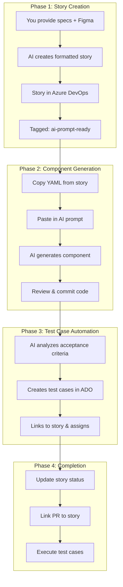

# Azure DevOps Integration

This section provides templates and prompts for integrating Azure DevOps work items with AI-powered component development for the Sitecore XMC Next.js application.

## 📋 Overview

The Azure DevOps integration enables a seamless workflow from project management to code generation:

1. **Project Managers** create structured User Stories using the [Component Story Template](./azuredevops-component-story-template)
2. **Developers** convert those stories into AI prompts using the [Story → AI Prompt](./azuredevops-to-ai-component-prompt) template
3. **AI** generates production-ready components following FastLane standards

---

## 🔧 Setting Up Azure DevOps MCP in Cursor

The Model Context Protocol (MCP) allows Cursor to directly interact with Azure DevOps - querying work items, creating stories, updating status, and more.

### Prerequisites

- **Node.js** installed (v18 or higher recommended)
- **Azure DevOps account** with access to your organization
- **Personal Access Token (PAT)** from Azure DevOps

### Step 1: Generate a Personal Access Token (PAT)

1. Go to [Azure DevOps](https://dev.azure.com)
2. Click on your **profile icon** (top right) → **Personal access tokens**
3. Click **+ New Token**
4. Configure the token:
   - **Name**: `Cursor MCP Integration`
   - **Organization**: Select your organization
   - **Expiration**: Set as needed (max 1 year)
   - **Scopes**: Select the following permissions:
     - ✅ **Work Items**: Read & Write
     - ✅ **Code**: Read (if you want code search)
     - ✅ **Project and Team**: Read
5. Click **Create** and **copy the token** (you won't see it again!)

### Step 2: Create/Edit the MCP Configuration File

1. **Locate your Cursor MCP config file:**
   - **Windows**: `C:\Users\<username>\.cursor\mcp.json`
   - **macOS**: `~/.cursor/mcp.json`
   - **Linux**: `~/.cursor/mcp.json`

2. **Create or edit `mcp.json`** with the following content:

```json
{
  "mcpServers": {
    "azure-devops": {
      "command": "npx",
      "args": ["-y", "@ryancardin/azuredevops-mcp-server@latest"],
      "env": {
        "AZURE_DEVOPS_ORG_URL": "https://dev.azure.com/YOUR_ORGANIZATION",
        "AZURE_DEVOPS_PROJECT": "YOUR_PROJECT_NAME",
        "AZURE_DEVOPS_AUTH_TYPE": "pat",
        "AZURE_DEVOPS_PERSONAL_ACCESS_TOKEN": "YOUR_PAT_TOKEN_HERE"
      }
    }
  }
}
```

3. **Replace the placeholder values:**
   - `YOUR_ORGANIZATION`: Your Azure DevOps organization name (e.g., `Contoso`)
   - `YOUR_PROJECT_NAME`: Your project name (e.g., `FastLane AI Accelerator`)
   - `YOUR_PAT_TOKEN_HERE`: The PAT you generated in Step 1

### Step 3: Restart Cursor

After saving `mcp.json`, **restart Cursor** completely to load the new MCP server configuration.

### Step 4: Verify the Connection

In Cursor, you can test the connection by asking:

```
List my work items from Azure DevOps
```

Or use the MCP tools directly:

```
@azure-devops list user stories
```

### Example Configuration

Here's a complete example configuration:

```json
{
  "mcpServers": {
    "azure-devops": {
      "command": "npx",
      "args": ["-y", "@ryancardin/azuredevops-mcp-server@latest"],
      "env": {
        "AZURE_DEVOPS_ORG_URL": "https://dev.azure.com/Altudodemo",
        "AZURE_DEVOPS_PROJECT": "Fastlane AI Accelerator",
        "AZURE_DEVOPS_AUTH_TYPE": "pat",
        "AZURE_DEVOPS_PERSONAL_ACCESS_TOKEN": "xxxxxxxxxxxxxxxxxxxxxxxxxxxxxxxxxxxxxxxxxxxxxxxxxxxxx"
      }
    }
  }
}
```

### Available MCP Commands

Once connected, you can use these commands in Cursor:

| Command | Description |
|---------|-------------|
| `List work items` | Query work items using WIQL |
| `Get work item by ID` | Retrieve specific work item details |
| `Create work item` | Create new User Story, Task, Bug, etc. |
| `Update work item` | Modify existing work items |
| `Search work items` | Search by text |
| `Get my work items` | List items assigned to you |
| `List sprints` | View sprint information |
| `List repositories` | Browse code repositories |

### Troubleshooting

| Issue | Solution |
|-------|----------|
| **"Access Denied: PAT expired"** | Generate a new PAT and update `mcp.json` |
| **"Project not found"** | Verify project name matches exactly (case-sensitive) |
| **"Organization not found"** | Check the org URL format: `https://dev.azure.com/OrgName` |
| **MCP not loading** | Restart Cursor after editing `mcp.json` |
| **Commands not working** | Ensure Node.js v18+ is installed and in PATH |

### Security Best Practices

- ⚠️ **Never commit `mcp.json` to version control** - it contains your PAT
- 🔒 **Set PAT expiration** - Use the shortest expiration that works for you
- 🔑 **Use minimal permissions** - Only grant scopes you actually need
- 🔄 **Rotate PATs regularly** - Update before expiration

---

## 🔗 Available Resources

### [Component Story Template](./azuredevops-component-story-template)
Template for creating Azure DevOps User Stories that are directly convertible into AI prompts. Includes:
- YAML specification format for unambiguous component requirements
- HTML and Markdown formatting options
- Complete field descriptions and examples
- Accessibility, internationalization, and performance requirements

### [Story → AI Prompt](./azuredevops-to-ai-component-prompt)
Prompt template for converting Azure DevOps User Stories into AI-generated components. Features:
- Direct YAML-to-code conversion
- Full TypeScript/Next.js component generation
- Comprehensive unit test generation
- Barrel export file creation

### [Test Case Automation](./azuredevops-test-case-automation)
Automated workflow for creating and linking test cases to component stories. Features:
- AI-powered test case generation from acceptance criteria
- Automatic linking to parent stories via "Tests" relationship
- Coverage for functional, interaction, accessibility, and edge cases
- Integration with existing Test Plans and Test Suites

## 🎯 Complete Workflow



---

## 🤖 Phase 1: AI-Assisted Story Creation

You can use Cursor AI to create properly formatted Azure DevOps stories directly from your specifications and Figma designs.

### What You Provide

| Input | Description | Example |
|-------|-------------|---------|
| **Component Name** | PascalCase name | `Badge`, `Modal`, `Dropdown` |
| **Figma URL** | Link to the design | `https://figma.com/file/xxx` |
| **Purpose** | What the component does | "Display status labels" |
| **Variants** | Visual variations | `primary`, `secondary`, `outline` |
| **Sizes** | Size options | `sm`, `md`, `lg` |
| **Props** | Component properties | `label`, `variant`, `icon` |
| **Special Requirements** | Accessibility, animations | "Must announce to screen readers" |

### What Gets Created

The AI will create a properly formatted Azure DevOps Issue with:

- ✅ **Title** following naming convention: `[ComponentName] Component - [Description]`
- ✅ **HTML-formatted description** (won't appear jumbled)
- ✅ **Human-readable overview** section for PMs/designers
- ✅ **Complete YAML specification** for AI implementation
- ✅ **Tags**: `component; ai-prompt-ready`

### Example: Creating a Story

**You say:**
> "Create a Badge component story from this Figma: https://figma.com/file/ABC123
> - Variants: success, warning, error, info, neutral
> - Sizes: sm, md
> - Props: label (required string), variant, size, icon (optional)
> - Should be accessible with proper color contrast"

**AI creates in Azure DevOps:**

```
Title: Badge Component - Status and Label Display
Tags: component; ai-prompt-ready
State: To Do

Description:
├── Component Overview (human-readable)
├── Key Requirements
├── Design Reference (Figma link)
└── YAML Specification (AI-ready)
```

### Try It Now

Just tell Cursor:

```
Create an Azure DevOps story for a [ComponentName] component.
Figma: [your-figma-url]
Purpose: [what it does]
Variants: [list variants]
Sizes: [list sizes]
Props: [list props with types]
```

---

## 🛠️ Phase 2: Component Generation from Story

Once a story is created with the YAML specification, developers can generate the component code using AI.

### Step 1: Find Ready Stories

Query Azure DevOps for stories ready for implementation:

```
List work items with tags "component" and "ai-prompt-ready"
```

Or use WIQL:
```sql
SELECT [System.Id], [System.Title], [System.State]
FROM WorkItems
WHERE [System.Tags] CONTAINS 'ai-prompt-ready'
  AND [System.Tags] CONTAINS 'component'
  AND [System.State] = 'To Do'
```

### Step 2: Copy the YAML Specification

From the story description, copy the YAML block inside `<pre><code>...</code></pre>`:

```yaml
componentName: Badge
componentType: presentational
summary: Display status labels and counts
# ... rest of YAML
```

### Step 3: Use the Component Generation Prompt

Paste the YAML into this prompt in Cursor:

````text
You are generating a production-ready React/TypeScript UI component for a Sitecore XMC Next.js application based on this YAML spec:

[SPEC START]
<PASTE YOUR YAML HERE>
[SPEC END]

Requirements:
- Implement exactly as specified in the YAML: props, variants, sizes, states, accessibility requirements, and design tokens.
- Tech stack: Sitecore XMC + Next.js + TypeScript; testing with Jest + React Testing Library.
- Follow design tokens and constraints precisely. No placeholders, no TODOs, no dead code.
- Accessibility: implement all specified role/aria attributes and keyboard interactions; ensure focus-visible states are properly styled.
- Performance: ensure SSR-safe code, minimal bundle size, avoid client-only APIs unless explicitly required.
- All prop types must be strictly typed (no any or unknown).

Output the following files as separate code blocks with explicit paths:
- path=<baseDir>/<ComponentName>.tsx (main component implementation)
- path=<baseDir>/<ComponentName>.test.tsx (comprehensive unit tests covering all states/variants; include axe accessibility tests)
- path=<baseDir>/index.ts (clean barrel export)

Conventions:
- Name the component exactly as specified in componentName field.
- Use strong TypeScript typing for all props and internal state.
- Apply styling as specified in the YAML (Tailwind classes or design tokens).
- Ensure the component matches the usageExample provided.
- Follow Next.js best practices for server and client components.

Start your response with the component files only. No explanatory prose before the code blocks.
````

### Step 4: Review Generated Code

The AI will output:

```
📁 src/components/ui/Badge/
├── Badge.tsx          # Main component
├── Badge.test.tsx     # Unit tests (90%+ coverage)
└── index.ts           # Barrel export
```

**Review checklist:**
- [ ] All variants render correctly
- [ ] Props match YAML specification
- [ ] Accessibility requirements met
- [ ] Tests cover all scenarios
- [ ] No TypeScript errors

### Step 5: Update Story Status

After implementing:

```
Update work item #[ID] state to "Done"
Add comment: "Component implemented in PR #[PR-number]"
```

---

## 🧪 Phase 3: Test Case Automation

After a component is implemented, create comprehensive test cases automatically using AI.

### What Gets Created

The AI analyzes your story's acceptance criteria and YAML specification to generate test cases covering:

| Category | Example Test Cases |
|----------|-------------------|
| **Functional** | All variants render correctly, all sizes work |
| **Interaction** | Hover triggers, click handlers, focus management |
| **Accessibility** | axe audit passes, ARIA attributes present |
| **Keyboard** | Tab navigation, Escape to close, Enter to activate |
| **Edge Cases** | Empty content, long text, rapid interactions |

### Quick Start

Use this prompt to generate test cases for any story:

```text
Analyze Azure DevOps story #[STORY_ID] and create comprehensive test cases.
Link each test case to the story and assign to [EMAIL].
Cover: functional, interaction, accessibility, and edge cases.
```

### Example

**Input:**
```
Create test cases for story #45 (Tooltip Component).
Assign to: developer@company.com
```

**Output:**
| ID | Test Case | Category |
|----|-----------|----------|
| #46 | Tooltip - Verify placement positions | Functional |
| #47 | Tooltip - Verify hover with delay | Interaction |
| #48 | Tooltip - Verify axe compliance | Accessibility |
| #49 | Tooltip - Verify keyboard navigation | Accessibility |
| #50 | Tooltip - Verify all variants | Functional |
| #51 | Tooltip - Verify size variations | Functional |

### Full Documentation

See [Test Case Automation](./azuredevops-test-case-automation) for:
- Complete prompt template with all parameters
- Test case structure and HTML formatting
- Linking to existing Test Plans and Test Suites
- Batch creation for multiple stories
- Troubleshooting guide

---

## 📋 Quick Reference: Full Workflow Example

### 1️⃣ Create Story (PM or via AI)

**Input:**
```
Create a Chip component story.
Figma: https://figma.com/file/XYZ
Purpose: Selectable tag/filter chips
Variants: filled, outlined
Sizes: sm, md
Props: label, selected (boolean), onSelect callback, disabled
```

**Output:** Azure DevOps Issue #52 created ✅

### 2️⃣ Generate Component (Developer)

```
Get work item #52 and generate the component using the YAML spec
```

**Output:** 
- `Chip.tsx` - Component code
- `Chip.test.tsx` - Unit tests
- `index.ts` - Export

### 3️⃣ Create Test Cases (QA/Developer)

```
Create test cases for story #52. 
Link to the story and assign to qa@company.com.
Cover functional, interaction, and accessibility.
```

**Output:** 
- Test Case #53: Chip - Verify variants (filled, outlined) ✅
- Test Case #54: Chip - Verify selection behavior ✅
- Test Case #55: Chip - Verify accessibility compliance ✅
- Test Case #56: Chip - Verify disabled state ✅

### 4️⃣ Complete (Developer)

```
Update work item #52 to Done with comment "Implemented in PR #123"
```

**Output:** Story closed, linked to PR, test cases ready for execution ✅

---

## ✅ Benefits

- **Consistency**: Every component follows the same specification format
- **Traceability**: Direct link from requirements → implementation → test cases
- **Quality**: AI generates code that meets all defined acceptance criteria
- **Speed**: Reduce component development time from hours to minutes
- **Test Coverage**: Automatic test case generation ensures nothing is missed
- **Collaboration**: Clear handoff between PMs, designers, developers, and QA
- **Automation**: MCP integration enables end-to-end workflow in Cursor

---

## 📚 Related Resources

- [Component Story Template](./azuredevops-component-story-template) - Full template documentation
- [Story → AI Prompt](./azuredevops-to-ai-component-prompt) - Detailed prompt reference
- [Test Case Automation](./azuredevops-test-case-automation) - Automated test case creation and linking
- [Component Creation Template](../templates/create-component) - General component creation prompt
- [Unit Test Creation Template](../templates/create-unit-test) - Test generation prompt
- [Core Requirements](../templates/core-requirements) - FastLane coding standards

