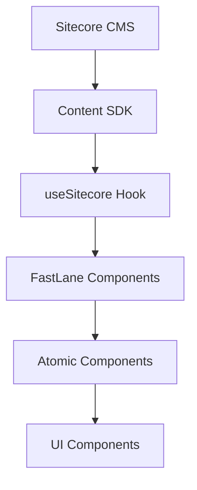
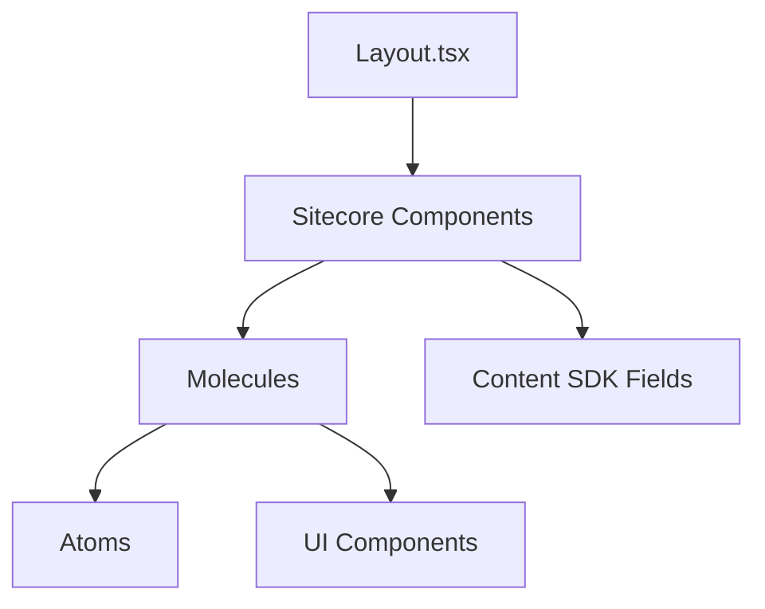

# FastLane Core Architecture Guide

This guide explains FastLane's architectural patterns and core structure, based on the actual codebase organization.

## 🏗️ Project Structure Overview

FastLane follows a well-organized atomic design architecture:

```
headapps/nextjs-starter/src/
├── components/              # Sitecore-integrated components
│   ├── Breadcrumb.tsx
│   ├── ArticleDate.tsx
│   ├── NavigationItem.tsx
│   ├── image/              # Component families
│   ├── navigation/
│   └── content-block/
├── core/                   # Reusable foundation
│   ├── atom/              # Base UI elements
│   ├── molecules/         # Composite components
│   ├── ui/                # Design system components
│   ├── lib/               # Utilities
│   └── context/           # React contexts
├── types/                 # TypeScript definitions
├── lib/                   # Shared utilities
├── pages/                 # Next.js pages
├── styles/                # Global styles
└── Layout.tsx             # Main layout component
```

## 🧱 Atomic Design Structure

### Components (`/components`)

**Purpose**: Sitecore-integrated components that connect to the CMS

**Characteristics**:
- Use `useSitecore()` hook
- Handle Content SDK field rendering
- Manage page mode detection
- Include comprehensive test coverage

**Example Structure**:
```typescript
// components/ArticleDate.tsx
import { useSitecore, DateField } from '@sitecore-content-sdk/nextjs';

export const Default = (props: ArticleDateProps): JSX.Element => {
  const { page } = useSitecore();  // 🎯 Sitecore integration
  
  // Component logic with CMS awareness
};
```

### Atoms (`/core/atom`)

**Purpose**: Base UI elements - the building blocks

**Examples**:
- `Images` - Sitecore image rendering
- `Link` - Sitecore link rendering
- Basic form elements
- Icons and graphics

**Usage Pattern**:
```typescript
// Used throughout FastLane
import { SitecoreImage } from 'src/core/atom/Images';
import { SitecoreLink } from 'src/core/atom/Link';

// In components
<SitecoreImage field={fields.Image} className="w-full h-auto" />
<SitecoreLink field={fields.TargetUrl}>Click here</SitecoreLink>
```

### Molecules (`/core/molecules`)

**Purpose**: Composite components that combine atoms

**Structure**:
```
core/molecules/
├── ContentCard/
│   ├── CardItem.tsx           # Main implementation
│   ├── ContentCard.type.ts    # TypeScript types
│   └── ContentCardBtn.tsx     # Sub-component
├── NavigationItem/
├── Header/
└── Footer/
```

**Example**:
```typescript
// core/molecules/ContentCard/CardItem.tsx
import { SitecoreImage } from 'src/core/atom/Images';
import { Card } from 'src/core/ui/card';

const CardItem = ({ fields, CardOrientation }: CardItemProps) => {
  return (
    <Card className="font-satoshi overflow-hidden p-6">
      {fields?.Icon?.value?.src && (
        <SitecoreImage field={fields.Icon} className="w-8 h-8" />
      )}
      <Text field={fields.Title} tag="h3" />
      <RichText field={fields.Description} />
    </Card>
  );
};
```

### UI Components (`/core/ui`)

**Purpose**: Pure design system components (no Sitecore dependencies)

**Examples**:
- `breadcrumb` - Breadcrumb navigation patterns
- `card` - Card component variants
- `button` - Button design system
- `form` - Form controls

**Usage**:
```typescript
// Used in FastLane components
import {
  Breadcrumb,
  BreadcrumbItem,
  BreadcrumbLink,
  BreadcrumbList,
} from 'src/core/ui/breadcrumb';

// Clean, reusable UI patterns
<Breadcrumb className="mb-5">
  <BreadcrumbList>
    {/* Breadcrumb items */}
  </BreadcrumbList>
</Breadcrumb>
```

## 🔧 Core Utilities

### Library (`/core/lib`)

**Purpose**: Core utilities and helpers

**Key Utilities**:
- `utils.ts` - Common utility functions (cn, etc.)
- Component helpers
- Styling utilities

### Shared Library (`/lib`)

**Purpose**: Application-wide utilities

**Key Modules**:
- `component-props/` - Standardized prop interfaces
- Sitecore helpers
- Configuration utilities

**Component Props Interface**:
```typescript
// lib/component-props/index.ts
export type ComponentProps = {
  rendering: ComponentRendering;
  params: ComponentParams & {
    RenderingIdentifier?: string;
    styles?: string;
    EnabledPlaceholders?: string;
  };
};
```

## 🎯 Context Architecture

### Context Providers (`/core/context`)

**Purpose**: Application-wide state management

**Examples**:
- **Theme context** - FastLane's custom theming system (`/core/context/ThemeContext.tsx`)
- User context
- Application settings

**FastLane's Theme System**:
```typescript
// FastLane's custom ThemeProvider (NOT Content SDK)
// src/core/context/ThemeContext.tsx
<ThemeProvider>
  <UserProvider>
    <App />
  </UserProvider>
</ThemeProvider>

// Usage in components
const { theme, toggleTheme } = useTheme();
```

## 🎭 FastLane's Custom Theming System

### Theme Context Implementation

FastLane includes a **custom-built theming system** (separate from Content SDK or starter kit examples):

**Location**: `src/core/context/ThemeContext.tsx`

**Features**:
- 🌙 **Dark/Light Mode** - Automatic and manual theme switching
- 💾 **localStorage Persistence** - Remembers user preference
- 🎯 **System Preference Detection** - Respects OS color scheme
- ⚡ **Real-time Switching** - Instant theme updates

**Implementation**:
```typescript
// FastLane's custom ThemeContext (NOT from Content SDK)
interface ThemeContextProps {
  theme: 'light' | 'dark';
  toggleTheme: () => void;
}

// Auto-detects system preference and persists to localStorage
const getInitialTheme = (): Theme => {
  // 1. Check localStorage
  // 2. Check system preference
  // 3. Default to light
};

export const ThemeProvider = ({ children, defaultTheme }) => {
  const [theme, setTheme] = useState<Theme>(() => defaultTheme || getInitialTheme());
  
  useEffect(() => {
    // Update DOM classes and localStorage
    document.documentElement.classList.remove('light', 'dark');
    document.documentElement.classList.add(theme);
    localStorage.setItem('theme', theme);
  }, [theme]);
  
  // ... system preference listener
};
```

**Usage in Components**:
```typescript
import { useTheme } from '../core/context/ThemeContext';

export const MyComponent = () => {
  const { theme, toggleTheme } = useTheme();
  
  return (
    <div className={`component theme-${theme}`}>
      <button onClick={toggleTheme}>
        Switch to {theme === 'light' ? 'dark' : 'light'} mode
      </button>
    </div>
  );
};
```

**Applied in Layout**: `src/pages/_app.tsx`
```typescript
// FastLane's app wrapper
<ThemeProvider>
  <Component {...pageProps} />
</ThemeProvider>
```

### vs. Starter Kit Examples

**FastLane's Custom System** (in use):
- Custom React Context (`ThemeContext.tsx`)
- localStorage persistence
- System preference detection
- DOM class manipulation

**Starter Kit Examples** (examples only):
- Uses `next-themes` library
- Different implementation approach
- Located in `/examples/` folder

## 📝 Type System

### Types Directory (`/types`)

**Purpose**: Centralized TypeScript definitions

**Structure**:
```
types/
├── Breadcrumb.types.ts    # Domain-specific types
├── common.types.ts        # Shared interfaces
└── component.types.ts     # Component prop types
```

**Example**:
```typescript
// types/Breadcrumb.types.ts
export interface Breadcrumb {
  Url: string;
  PageTitle: string;
  HideInBreadcrumb: boolean;
}
```

## 🎨 Styling Architecture

### Global Styles (`/styles`)

**Purpose**: Application-wide styling

- Tailwind CSS configuration
- Global CSS variables
- Design tokens
- Component-specific styles

### Component Styling

**Pattern**: Tailwind CSS with conditional classes

```typescript
// Styling pattern in FastLane
import { cn } from 'src/core/lib/utils';

const MyComponent = ({ orientation, isActive }) => (
  <div className={cn(
    'base-classes',
    {
      'variant-classes': orientation === 'vertical',
      'active-classes': isActive,
    }
  )}>
    Content
  </div>
);
```

## 🚀 Layout Architecture

### Main Layout (`/Layout.tsx`)

**Purpose**: Application shell and routing

**Key Features**:
- Design Library integration
- Meta tag management
- Page mode detection
- Header/footer orchestration

```typescript
// Layout.tsx structure
const Layout = ({ page }: LayoutProps) => {
  const { mode } = page;
  
  return (
    <>
      <Head>{/* Meta management */}</Head>
      
      {mode.isDesignLibrary ? (
        <DesignLibrary />
      ) : (
        <>
          <header>{/* Header components */}</header>
          <main>{/* Main content */}</main>
          <footer>{/* Footer components */}</footer>
        </>
      )}
    </>
  );
};
```

## 🔄 Data Flow Architecture

### Content SDK Integration



### Component Hierarchy



## 🧪 Testing Architecture

### Test Organization

```
components/
├── Component.tsx
├── Component.test.tsx     # Component-specific tests
└── __tests__/            # Additional test files

core/
├── molecules/
│   └── Component/
│       ├── Component.tsx
│       └── Component.test.tsx
```

### Testing Patterns

**Sitecore Integration Tests**:
```typescript
// Test useSitecore integration
mockUseSitecore.mockReturnValue({
  page: { /* page context */ }
});
```

**Pure Component Tests**:
```typescript
// Test UI components without Sitecore mocking
render(<UIComponent {...props} />);
```

## 📦 Build Architecture

### Next.js Integration

```
pages/
├── _app.tsx              # Application wrapper
├── _document.tsx         # HTML document structure
├── [[...path]].tsx       # Dynamic routing
└── api/                  # API routes
```

### Static Generation

- **ISR (Incremental Static Regeneration)** for content pages
- **Design Library data fetching** for component showcase
- **Preview mode** for content editing

## 🎯 Development Workflow

### Component Development Flow

1. **Define Types** → `/types/Component.types.ts`
2. **Create UI Component** → `/core/ui/component.tsx` (if needed)
3. **Build Molecule** → `/core/molecules/Component/` (if composite)
4. **Create Sitecore Component** → `/components/Component.tsx`
5. **Add Tests** → `Component.test.tsx`
6. **Register in componentMap** → For Sitecore rendering

### Best Practices

**1. Separation of Concerns**
- UI logic in `/core/ui`
- Business logic in `/core/molecules`
- Sitecore integration in `/components`

**2. Reusability**
- Atoms for basic elements
- Molecules for composite patterns
- UI components for design system

**3. Testability**
- Pure components are easily testable
- Sitecore integration tested separately
- Comprehensive mock strategies

## 🔧 Configuration

### Environment Structure

```
├── .env.local            # Local development
├── .env.remote.example   # Environment template
├── next.config.js        # Next.js configuration
├── tailwind.config.js    # Styling configuration
├── tsconfig.json         # TypeScript configuration
└── vitest.config.ts      # Testing configuration
```

## 🎯 Next Steps

- **Component Development**: See the [FastLane Component Development Guide](./component-development.md)
- **Testing**: See the [FastLane Testing Guide](./testing.md)
- **Design Library**: See the [FastLane Design Library Guide](./design-library.md)

---

This architecture provides **scalability**, **maintainability**, and **developer experience** while maintaining **clean separation of concerns** between UI logic and Sitecore integration. 