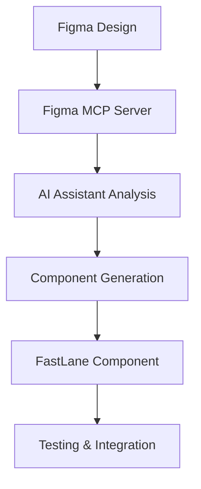

# Development Tools

Essential tools and integrations for FastLane and Content SDK development workflows.

## 🛠️ Available Tools

### [Figma MCP Server Setup](./figma-mcp-server-setup)
**AI-Powered Design Integration**

Set up the Figma Model Context Protocol (MCP) server to enable direct AI access to Figma designs in your development workflow.

**Key Features:**
- 🎨 **Direct Figma Access** - AI reads designs without manual export
- 🎯 **Design Token Extraction** - Automatic color, typography, and spacing analysis
- 🧩 **Component Analysis** - Understand design patterns and layouts
- ⚡ **Accurate Code Generation** - Create components that precisely match designs

**Perfect for:**
- Converting Figma designs to FastLane components
- Extracting design tokens for Tailwind configuration
- Automated component generation with AI assistance
- Design-to-code workflow optimization

## 🎯 Tool Integration Workflow

### Design-to-Component Pipeline



### Recommended Development Stack

#### Core Tools
- **[Figma MCP Server](./figma-mcp-server-setup)** - Design integration
- **Cursor** - AI-powered editor with MCP support
- **Node.js 18+** - Runtime environment

#### FastLane-Specific Tools
- **Vitest** - Testing framework
- **React Testing Library** - Component testing
- **Tailwind CSS** - Utility-first styling
- **TypeScript** - Type safety

#### Sitecore Tools
- **Sitecore Content SDK** - Headless development framework
- **XM Cloud Deploy** - Deployment and hosting
- **Content Editor** - Content management interface

## 🚀 Integration Examples

### Figma to Component Workflow

**1. Design Analysis:**
```bash
# AI prompt with Figma MCP
"Analyze this Figma component: [FIGMA_URL]
Extract design tokens and component structure."
```

**2. Component Generation:**
```bash
# Use create-component.md prompt
"Generate a FastLane component matching this design:
- Use extracted design tokens
- Include Sitecore field bindings
- Follow atomic design patterns"
```

**3. Testing Setup:**
```bash
# Generate comprehensive tests
"Create unit tests for this component:
- Content SDK mocking
- Responsive behavior testing
- Accessibility compliance"
```

### Design Token Extraction

**Extract from Figma:**
```javascript
// AI-generated Tailwind config from Figma
module.exports = {
  theme: {
    colors: {
      primary: '#0066cc',    // Extracted from Figma
      secondary: '#ff6b35',  // Extracted from Figma
    },
    spacing: {
      '18': '4.5rem',       // Custom spacing from design
    },
    fontSize: {
      'display': '3.5rem',  // Typography scale from Figma
    }
  }
};
```

## 🔧 Tool Configuration

### IDE Extensions

**Recommended Extensions:**
```json
{
  "recommendations": [
    "bradlc.vscode-tailwindcss",
    "esbenp.prettier-vscode",
    "ms-vscode.vscode-typescript-next",
    "vitest.explorer",
    "figma.figma-vscode-extension"
  ]
}
```

### Environment Setup

**Development Environment:**
```bash
# Install tools globally
npm install -g @sitecore-content-sdk/cli
npm install -g @modelcontextprotocol/server-figma

# Project-specific tools
npm install vitest @testing-library/react
npm install tailwindcss typescript
```

## 📚 Tool-Specific Guides

### Figma Integration
- **[Figma MCP Server Setup](./tools/figma-mcp-server-setup)** - Complete setup guide
- **[Design Token Extraction](./tools/figma-mcp-server-setup#design-token-extraction)** - Automated token generation
- **[Component Analysis](./tools/figma-mcp-server-setup#component-analysis)** - Design pattern recognition

### AI Development Workflow
- **[Create Component Prompt](../component-development/ai-prompts/templates/create-component)** - AI component generation
- **[Using Create Component Prompt](../component-development/ai-prompts/guide-using-create-component-prompt)** - Workflow guide

### Azure DevOps Test Plans
- **[Test Plans Guide](../test-plans-guide)** - Create and manage test plans in Azure DevOps
- **MCP Integration** - Execute and monitor tests using MCP tools

## 🎯 Tool Selection Guide

### For Component Development
- **Primary**: [Figma MCP Server](./tools/figma-mcp-server-setup) + Cursor
- **Alternative**: Manual design analysis + create-component.md prompt

### For Testing
- **Primary**: Vitest + React Testing Library
- **Integration**: Content SDK mocking patterns
- **Coverage**: Built-in coverage reporting
- **Azure DevOps**: [Test Plans Guide](../test-plans-guide) for test plan management

### For Styling
- **Primary**: Tailwind CSS
- **Design Tokens**: Figma MCP extraction
- **Responsive**: Mobile-first approach

### For Type Safety
- **Primary**: TypeScript
- **Linting**: ESLint + Prettier
- **Validation**: Content SDK type definitions

## 🚀 Future Tools & Integrations

### Planned Integrations
- **Storybook MCP Server** - Component documentation automation
- **Accessibility Testing Tools** - Automated WCAG compliance checking
- **Performance Monitoring** - Core Web Vitals integration

### Community Tools
- **Design System CLI** - Generate design system components
- **Component Library Scanner** - Analyze existing component patterns
- **Migration Assistant** - JSS to Content SDK conversion tools

## 🔍 Troubleshooting

### Common Tool Issues

#### Figma MCP Not Connecting
**Solutions:**
1. Verify Cursor MCP configuration
2. Check Figma token permissions
3. Restart Cursor application

#### TypeScript Errors
**Solutions:**
1. Update Content SDK type definitions
2. Clear TypeScript cache
3. Restart VS Code TypeScript service

#### Build Issues
**Solutions:**
1. Clear Next.js cache: `rm -rf .next`
2. Reinstall dependencies: `rm -rf node_modules && npm install`
3. Check environment variable configuration

## 📊 Tool Performance

### Development Speed Improvements

| Task | Manual Approach | With Tools | Time Saved |
|------|-----------------|------------|------------|
| Design Analysis | 30 minutes | 2 minutes | 93% |
| Component Creation | 2 hours | 15 minutes | 87% |
| Test Generation | 1 hour | 5 minutes | 92% |
| Design Token Extraction | 45 minutes | 3 minutes | 93% |

## 🎯 Next Steps

**Getting Started:**

1. 🎨 **Set up [Figma MCP Server](./figma-mcp-server-setup)** for design integration
2. 🤖 **Learn [AI Prompts](../component-development/ai-prompts/)** for automated development
3. 🏗️ **Explore [FastLane Development](../component-development/fastlane/)** for component patterns

**Advanced Usage:**
- Integrate tools into CI/CD pipeline
- Automate design token updates
- Set up component library automation

---

**Supercharge your FastLane development** with powerful tools that automate design analysis, component generation, and testing workflows! 🚀 